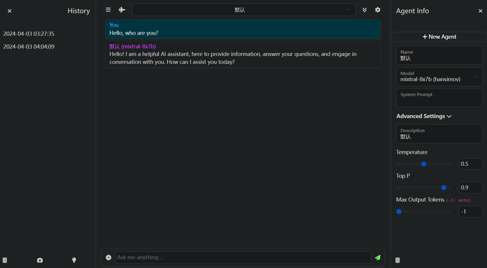
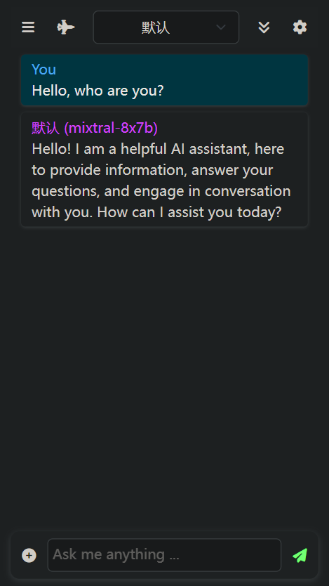

# LLM-Mixer


A lightweight UI of LLM app.

Mirror:
- https://hansimov-llm-mixer.hf.space

## Run server
### Command Line

```sh
sudo npm install
node server.js
```

### Docker

```sh
docker build -t llm-mixer:1.0 .
docker run llm-mixer:1.0
```

## Screenshots

<div align="center">



<b>Web</b>



<b>Mobile</b>

</div>